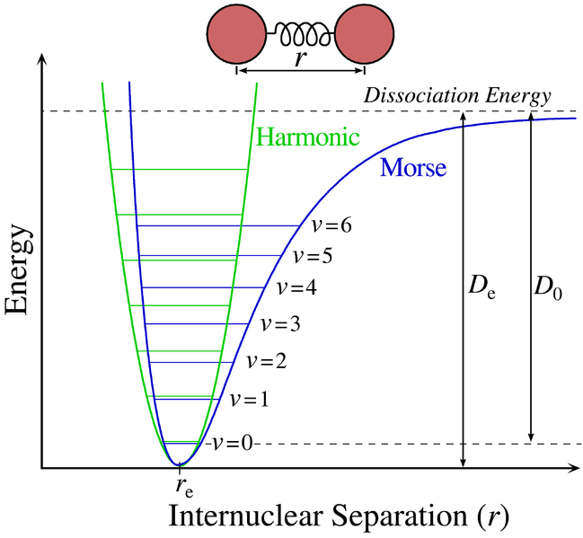
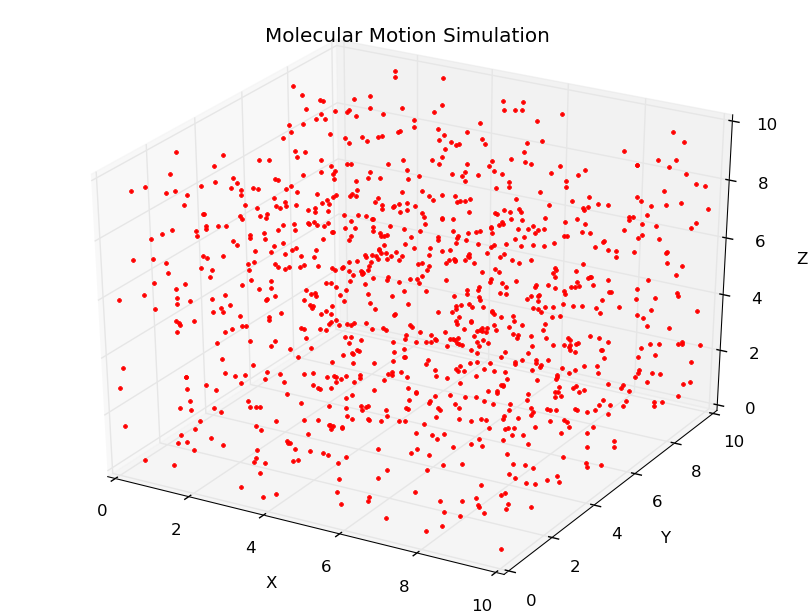

# 分子运动模拟

### 算法
**第一步**
	对所有原子的位置(pos)、速度(vel)、加速度(acc)进行初始化。各原子的位置、速度、加速度信息分别存储在一维数组 pos[i+j*nd]、vel[i+j*nd]、acc[i+j*nd]中。i 取值为 0、1、2,分别对应 x 轴、y 轴、z 轴三个空间方向上的各个数值;j 代表原子的编号,从 0 到 999;nd 取值为 3,代表模型是一个三维立方体。其中,各原子的速度、加速度都初始化为 0;原子的位置是一组生成的随机数,在 x、y、z 轴方向的取值都在 0 到 10 之间,即限制在 10x10x10 的立方体空间内。

**第二步**
	计算原子的作用力与能量。以 Harmonic 势(harmonic potential)为基础对原子的势能进行计算。Harmonic 势就是将胡克定律(Hooke's Law)应用到对原子间作用力的分析中,想象两个原子间有一根弹簧相连接,那么两个原子的势能变化会符合以下的曲线:

图 6 势能曲线(图中绿色曲线为 Harmonic 势的变化情况)

当两个原子间距离极小时,它们之间的斥力非常大,势能之和因此也非常大。随着间距的增加,原子间斥力不断减小,势能之和随之减小,直到到达平衡位置re ,此时斥力不存在,势能之和为 0。此后如果原子间距继续增加,原子间会产生引力,势能之和随之再次增加。在设计模型中,我们使用公式 sin ( min ( x, PI2 ) ) 2 来模拟势能的变化,它对Harmonic 势作出了一些改变。其中,x 代表原子间的距离,PI2 则代表π /2,min( x, PI2 )即取两者的较小值。根据公式,原子间距离为 PI2 时,势能达到最大值,而随着距离继续增加,势能不会再增加,这是因为原子间实际上并没有弹簧相连接,随着距离不断增加,原子间的引力也会衰减,因此原子的势能不可能无限增大。而当原子间距离为 0 时,依照公式,势能也为 0,这是对 Harmonic 势作出了简化,因为在原子间距为 PI2 时势能最大的情况下,依照 Harmonic 势的思想,原子间的平衡位置大约在 0.78 处,即只有当距离小于 0.78 时,势能才会从 0 开始增加。根据统计思想,1000 个原子随机分布在 10x10x10 的空间内,其中间距小于 0.78 的原子对非常之少,出于减化模型的考虑,我们忽略了这部分势能增加的计算。

**第三步**
	对原子运动状态进行更新。原子受到彼此间作用力的相互影响,在到达下一个时间点时,它们的位置、速度、加速度必然会发生变化。我们必须不断更新原子的位置、速度、加速度信息,才能实现分子运动的模拟。在设计模型中,我们使用了速度表示的韦尔莱算法(Velocity Verlet algorithm)对这些数值进行更新计算。韦尔莱算法是一种用于求解牛顿运动方程的数值方法,速度表示下的韦尔莱算法更为常用,它可以给出同一时间变量下的速度和位置,它的公式如下:
* x(t+dt) = x(t) + v(t) * dt + 0.5 * a(t) * dt 2
* v(t+dt) = v(t) + 0.5 * ( a(t) + a(t+dt) ) * dt
* a(t+dt) = f(t) / m
x、v、a 分别代表位置、速度与加速度。f 代表作用力,可以由第二步计算得到。m 代表原子的原子量。在本设计模型中,原子的变化以 0.0001 秒为单位进行计算,因此 dt 的取值为 0.0001。

### 文档说明
项目中包含以下三份文档
* molecularMotionSimulation.py
* plotMMS.py
* history.csv
	molecularMotionSimulation.py用来计算分子运动。由于本人机子是双核的，只能使用双进程并发，所以迭代一次的时间较长，需要10s左右的时间，而在单进程下需要20s多。如果将进程分成多个线程来运行，实际上只会用到计算机的一个核，并且由于线程通讯等开销反而使得运行时间更长。
	plotMMS.py用来将计算的数据可视化，由产生的数据进行三维动画模拟分子的运动。
	history.csv是本人生成的一组数据。	

